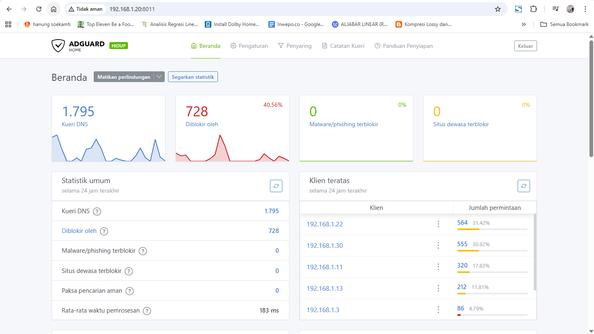
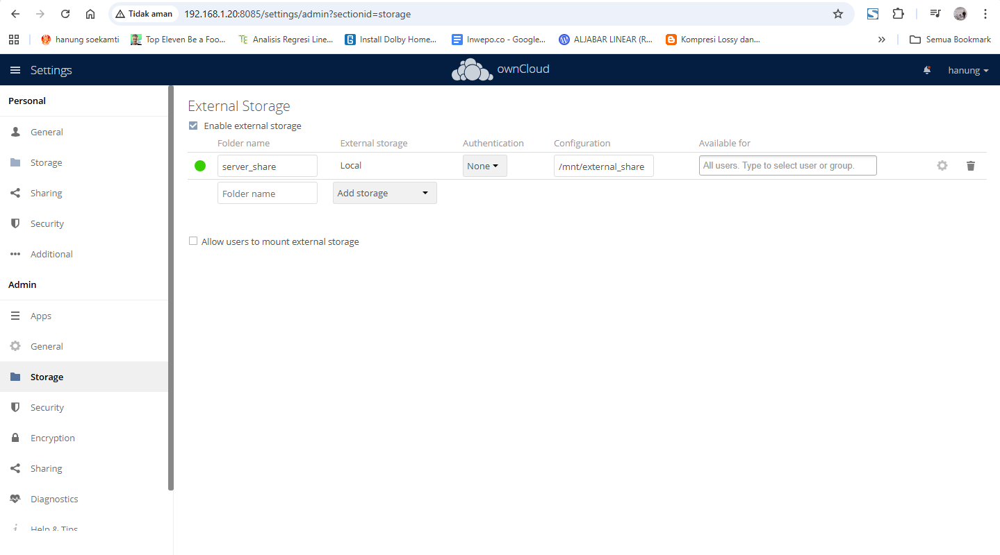
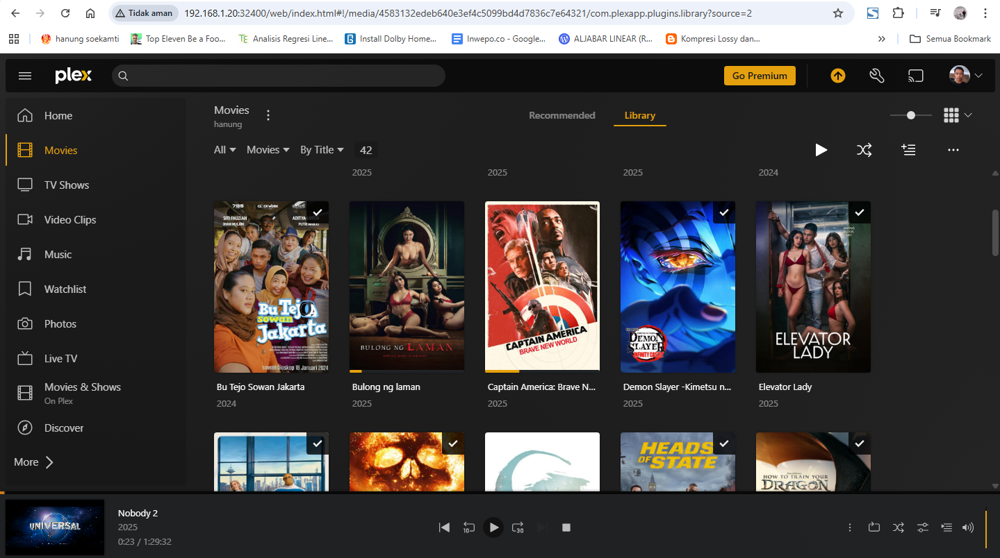
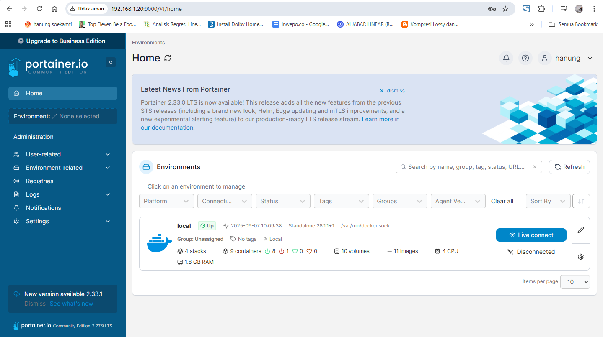

# 📡 Dokumentasi Jaringan Server

Dokumentasi ini berisi ringkasan konfigurasi, layanan aktif, serta topologi jaringan server **rumahan**.  
Server digunakan untuk kebutuhan sehari-hari seperti web service, database, media server, file sharing, dan VPN.
## Aplikasi yang Digunakan di Server

---

## 📑 Daftar Isi
- [🖥️ Spesifikasi Server](#️-spesifikasi-server)
- [📌 Ringkasan](#-ringkasan)
- [🛠️ Layanan Aktif](#️-layanan-aktif-di-server)
  - [🌐 Web Services](#-web-services)
  - [📡 DNS & Network](#-dns--network)
  - [💾 Database](#-database)
  - [📂 File & Sharing](#-file--sharing)
  - [🎥 Media & Remote](#-media--remote)
  - [🐳 Docker](#-docker)
  - [🔧 Lain-lain](#-lain-lain)
- [🔍 Detail Interface](#-detail-interface)
- [🗺️ Diagram Topologi](#️-diagram-topologi)
- [✅ Kesimpulan](#-kesimpulan)

---

## 🖥️ Spesifikasi Server
Server ini menggunakan **Notebook ASUS X452CP** dalam mode *headless*.  
Walaupun spesifikasi terbatas, server cukup stabil untuk kebutuhan rumahan.

**Detail Hardware:**
- 💻 Model: ASUS X452CP  
- ⚙️ CPU: Intel® Core™ i3-3217U (1.80 GHz)  
- 🧠 RAM: 2GB  
- 💽 Storage: HDD bawaan  
- 🐧 OS: Ubuntu 24.04.3 LTS  
- 🌐 IP Lokal: `192.168.1.20` (Static)  

  

---

## 📌 Ringkasan
Server menjalankan beragam service baik via **Docker** maupun **native (langsung di host)**.  
Port dan protokol diatur agar **tidak konflik** serta **mudah diakses**.

---

## 🛠️ Layanan Aktif di Server

### 🌐 Web Services
| Service        | IP           | Port(s) | Protokol | Host   | Status |
|----------------|-------------|---------|----------|--------|--------|
| **Caddy**      | 192.168.1.20 | [80](http://192.168.1.20:80) / [443](https://192.168.1.20) | HTTP/HTTPS | hanung | 🔓 Open |
| **Python App** | 192.168.1.20 | [5000](http://192.168.1.20:5000) | HTTP | hanung | 🔓 Open |
| **Python3**    | 192.168.1.20 | [8012](http://192.168.1.20:8012) | HTTP | hanung | 🔓 Open |
| **Docker Proxy** | 192.168.1.20 | [8000](http://192.168.1.20:8000), [8888](http://192.168.1.20:8888), [8081](http://192.168.1.20:8081), [8085](http://192.168.1.20:8085), [8086](http://192.168.1.20:8086), [9000](http://192.168.1.20:9000), [9443](https://192.168.1.20:9443) | HTTP/HTTPS | hanung | 🔓 Open |

---

### 📡 DNS & Network
| Service            | IP           | Port   | Protokol | Host   | Status |
|--------------------|-------------|--------|----------|--------|--------|
| **AdGuardHome**    | 192.168.1.20 | 53     | DNS      | hanung | ✅ aktif |
| **AdGuardHome Alt**| 192.168.1.20 | 8011   | Other    | hanung | ✅ aktif |
| **Tailscaled**     | 192.168.1.20 | 40539 / 65078 | VPN | hanung | ✅ aktif |

  

---

### 💾 Database
| Service     | IP           | Port | Protokol | Host   | Status |
|-------------|-------------|------|----------|--------|--------|
| **MariaDB** | 192.168.1.20 | 3307 | TCP      | hanung | ✅ aktif |

---

### 📂 File & Sharing
| Service       | IP           | Port     | Protokol | Host   | Status |
|---------------|-------------|----------|----------|--------|--------|
| **SMB**       | 192.168.1.20 | 139/445 | File     | hanung | ✅ aktif |
| **OwnCloud**  | 192.168.1.20 | 8085    | File     | hanung | ✅ aktif |

  

---

### 🎥 Media & Remote
| Service | IP           | Port   | Protokol | Host   | Status |
|---------|-------------|--------|----------|--------|--------|
| **Plex**| 192.168.1.20 | 32400 | Media    | hanung | ✅ aktif |

  

---

### 🐳 Docker
| Service     | IP           | Port | Protokol | Host   | Status |
|-------------|-------------|------|----------|--------|--------|
| **Portainer** | 192.168.1.20 | 9000 | Docker   | hanung | ✅ aktif |

  

---

### 🔧 Lain-lain
| Service          | IP           | Port         | Protokol   | Host   | Status |
|------------------|-------------|--------------|------------|--------|--------|
| **CUPS**         | 192.168.1.20 | 631          | Printer    | hanung | ✅ aktif |
| **Node.js App**  | 192.168.1.20 | 5511         | Other      | hanung | ✅ aktif |
| **Aria2c**       | 192.168.1.20 | 6800         | Download   | hanung | ✅ aktif |
| **Init**         | 192.168.1.20 | 9090         | Other      | hanung | ✅ aktif |
| **PMCD/PMProxy** | 192.168.1.20 | 44321-44323  | Monitoring | hanung | ✅ aktif |
| **Docker Proxy** | 192.168.1.20 | 32768-32769  | Other      | hanung | ✅ aktif |

---

## 🔍 Detail Interface

### 🖧 Interface Fisik
- **LAN (enp3s0f2)**: `192.168.1.20/24` → interface utama untuk internet/LAN.  
- **Wi-Fi (wlp2s0)**: tidak aktif.  

### 🔁 Loopback
- **lo**: `127.0.0.1` → komunikasi internal antar aplikasi.  

### 🐳 Docker
- **docker0**: `172.17.0.1/16` (default bridge)  
- **Custom bridge**:  
  - br-1955bdeca4fc → `172.18.0.1`  
  - br-2674075a9c1b → `172.23.0.1`  
  - br-525fea672d18 → `172.22.0.1`  
  - br-56e18e08920f → `172.24.0.1`  
  - br-7da4494dfde9 → `172.20.0.1`  
  - br-8cec9a14d87e → `172.26.0.1`  
  - br-a47c0b428dc3 → `172.21.0.1`  
  - br-c3c26e751091 → `172.25.0.1`  
  - br-f17882ea7749 → `172.27.0.1`  
  - br-f4706f414b66 → `172.19.0.1`  

### 🔐 VPN
- **WireGuard (wg0)**: `10.2.0.2`  
  → Digunakan sebagai gateway VPN untuk semua perangkat rumah via ProtonVPN SG.  
- **Tailscale (tailscale0)**: `100.119.11.49`  
  → VPN overlay berbasis WireGuard, dipakai untuk remote & file sharing tanpa IP publik.  

---

## 🗺️ Diagram Topologi
Visualisasi dari hasil `ifconfig`:

  

---

## ✅ Kesimpulan
1. Jaringan utama: **LAN via enp3s0f2 (192.168.1.20)**.  
2. Wi-Fi tidak digunakan.  
3. Docker aktif dengan banyak bridge dan kontainer.  
4. VPN ganda: **WireGuard (gateway utama)** & **Tailscale (remote access)**.  
5. Semua interface sehat, packet drop sangat kecil.  

