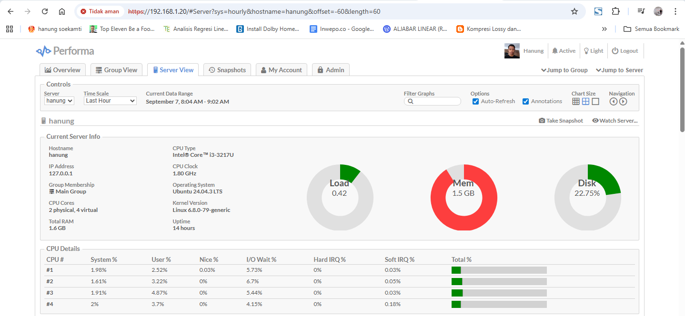

# Dokumentasi Jaringan Server

## Spesifikasi Server
Server ini menggunakan Notebook ASUS seri X452CP dengan mode headless dengan RAM serta HDD bawaan. Dengan spesifikasi seperti ini sudah dapat menangani kebutuhan rumahan yang ada.
Berikut ini adalah spesifikasi lengkapnya :
ASUS X452CP
CPU type    : Intel® Core™ i3-3217U
Clock Speed : 1.80 GHz
RAM         : 2GB 
OS          : Ubuntu 24.04.3 LTS
Lokal IP    : 192.168.1.20 (Static IP)

## Ringkasan
Server ini menjalankan beberapa service dengan kebutuhan dan port yang sudah diatur sedemikian rupa baik dengan Docker maupun running di server secara langsung dengan Python, berikut ini adalah beberapa service yang dijalankan : 
## Layanan Aktif di Server

### 🌐 Web Services
| Service        | IP           | Port         | Protokol | Host   | Status |
|----------------|-------------|--------------|----------|--------|--------|
| **Caddy**      | 192.168.1.20 | [80](http://192.168.1.20:80) / [443](https://192.168.1.20) | HTTP/HTTPS | hanung | Open |
| **Python App** | 192.168.1.20 | [5000](http://192.168.1.20:5000) | HTTP | hanung | Open |
| **Python3**    | 192.168.1.20 | [8012](http://192.168.1.20:8012) | HTTP | hanung | Open |
| **Docker Proxy** | 192.168.1.20 | [8000](http://192.168.1.20:8000), [8888](http://192.168.1.20:8888), [8081](http://192.168.1.20:8081), [8085](http://192.168.1.20:8085), [8086](http://192.168.1.20:8086), [9000](http://192.168.1.20:9000), [9443](https://192.168.1.20:9443) | HTTP/HTTPS | hanung | Open |

---

### 📡 DNS & Network
| Service            | IP           | Port | Protokol | Host   | Status |
|--------------------|-------------|------|----------|--------|--------|
| **AdGuardHome**    | 192.168.1.20 | 53   | DNS      | hanung | aktif |
| **AdGuardHome Alt**| 192.168.1.20 | 8011 | Other    | hanung | aktif |
| **systemd-resolved** | 192.168.1.20 | 53   | DNS      | zahra-pc | aktif |
| **Tailscaled**     | 192.168.1.20 | 40539 / 65078 | VPN | hanung | aktif |
| **Tailscaled**     | 192.168.1.20 | 58206 / 65107 | VPN | zahra-pc | aktif |

---

### 💾 Database
| Service     | IP           | Port | Protokol | Host   | Status |
|-------------|-------------|------|----------|--------|--------|
| **MariaDB** | 192.168.1.20 | 3307 | TCP      | hanung | aktif |

---

### 📂 File & Sharing
| Service | IP           | Port     | Protokol | Host   | Status |
|---------|-------------|----------|----------|--------|--------|
| **SMB** | 192.168.1.20 | 139/445 | File     | hanung | aktif |
| **SMB** | 192.168.1.20 | 139/445 | File     | zahra-pc | aktif |

---

### 🎥 Media & Remote
| Service            | IP           | Port   | Protokol | Host     | Status |
|--------------------|-------------|--------|----------|----------|--------|
| **Plex**           | 192.168.1.20 | 32400 | Media    | hanung   | aktif |
| **Plex**           | 192.168.1.20 | 32400 | Media    | zahra-pc | aktif |
| **RDP (Gnome)**    | 192.168.1.20 | 3390  | Remote   | zahra-pc | aktif |
| **AnyDesk**        | 192.168.1.20 | 7071  | Remote   | zahra-pc | aktif |

---

### 🔧 Lain-lain
| Service          | IP           | Port | Protokol | Host   | Status |
|------------------|-------------|------|----------|--------|--------|
| **CUPS**         | 192.168.1.20 | 631  | Printer  | hanung | aktif |
| **Node.js App**  | 192.168.1.20 | 5511 | Other    | hanung | aktif |
| **Aria2c**       | 192.168.1.20 | 6800 | Download | hanung | aktif |
| **Init**         | 192.168.1.20 | 9090 | Other    | hanung | aktif |
| **PMCD/PMProxy** | 192.168.1.20 | 44321-44323 | Monitoring | hanung | aktif |
| **Docker Proxy** | 192.168.1.20 | 32768-32769 | Other | hanung | aktif |

Server ini memiliki beberapa interface jaringan aktif berdasarkan hasil `ifconfig`.  
Interface terbagi menjadi:

- **Interface fisik**: LAN (aktif), Wi-Fi (nonaktif).
- **Interface virtual**: Docker bridge, WireGuard, Tailscale, loopback.
- **Kontainer Docker**: terhubung ke berbagai network bridge (`br-xxxx`).

## Detail Interface

### Interface Fisik
- **LAN (enp3s0f2)**: `192.168.1.20/24`  
  → Interface utama untuk koneksi ke internet/LAN.  
- **Wi-Fi (wlp2s0)**: Tidak aktif.

### Loopback
- **lo**: `127.0.0.1`  
  → Komunikasi internal antar aplikasi dalam server.

### Docker
- **docker0**: `172.17.0.1/16` (default bridge)  
- Beberapa custom bridge:
  - br-1955bdeca4fc → `172.18.0.1`
  - br-2674075a9c1b → `172.23.0.1`
  - br-525fea672d18 → `172.22.0.1`
  - br-56e18e08920f → `172.24.0.1`
  - br-7da4494dfde9 → `172.20.0.1`
  - br-8cec9a14d87e → `172.26.0.1`
  - br-a47c0b428dc3 → `172.21.0.1`
  - br-c3c26e751091 → `172.25.0.1`
  - br-f17882ea7749 → `172.27.0.1`
  - br-f4706f414b66 → `172.19.0.1`

### VPN
- **WireGuard (wg0)**: `10.2.0.2`  
  → VPN aktif, banyak traffic (224 MB RX).  
- **Tailscale (tailscale0)**: `100.119.11.49`  
  → VPN overlay via WireGuard, sedikit traffic.

---

## Diagram Topologi
Berikut visualisasi topologi dari hasil `ifconfig`:

---

## Kesimpulan
1. Jaringan utama: **LAN via enp3s0f2 (192.168.1.20)**  
2. **Wi-Fi tidak dipakai.**  
3. **Docker aktif**, dengan banyak bridge & kontainer.  
4. **VPN ganda**: WireGuard (aktif) & Tailscale (standby).  
5. Semua interface sehat, packet drop sangat kecil.

---
